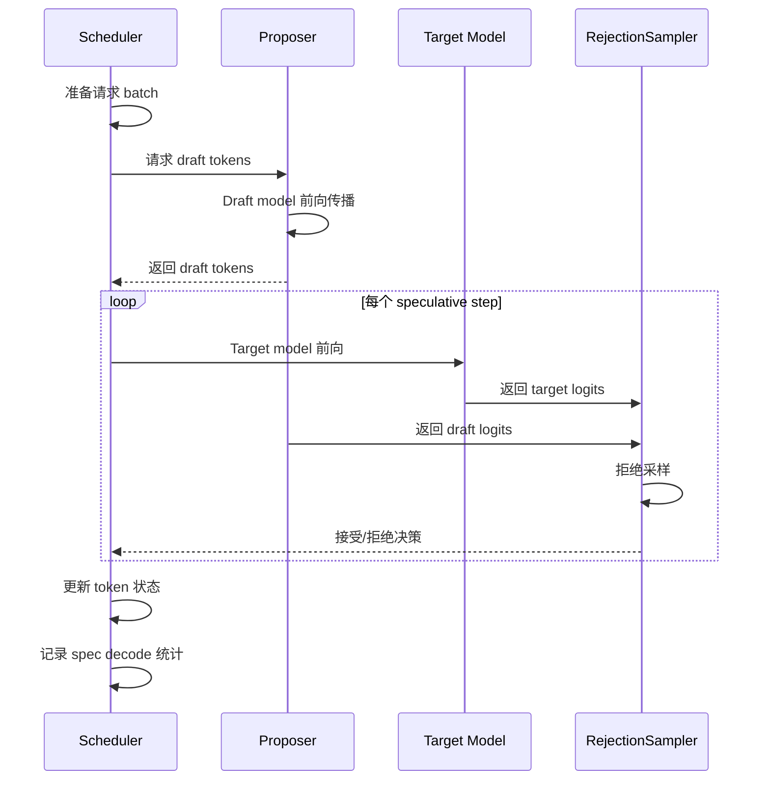
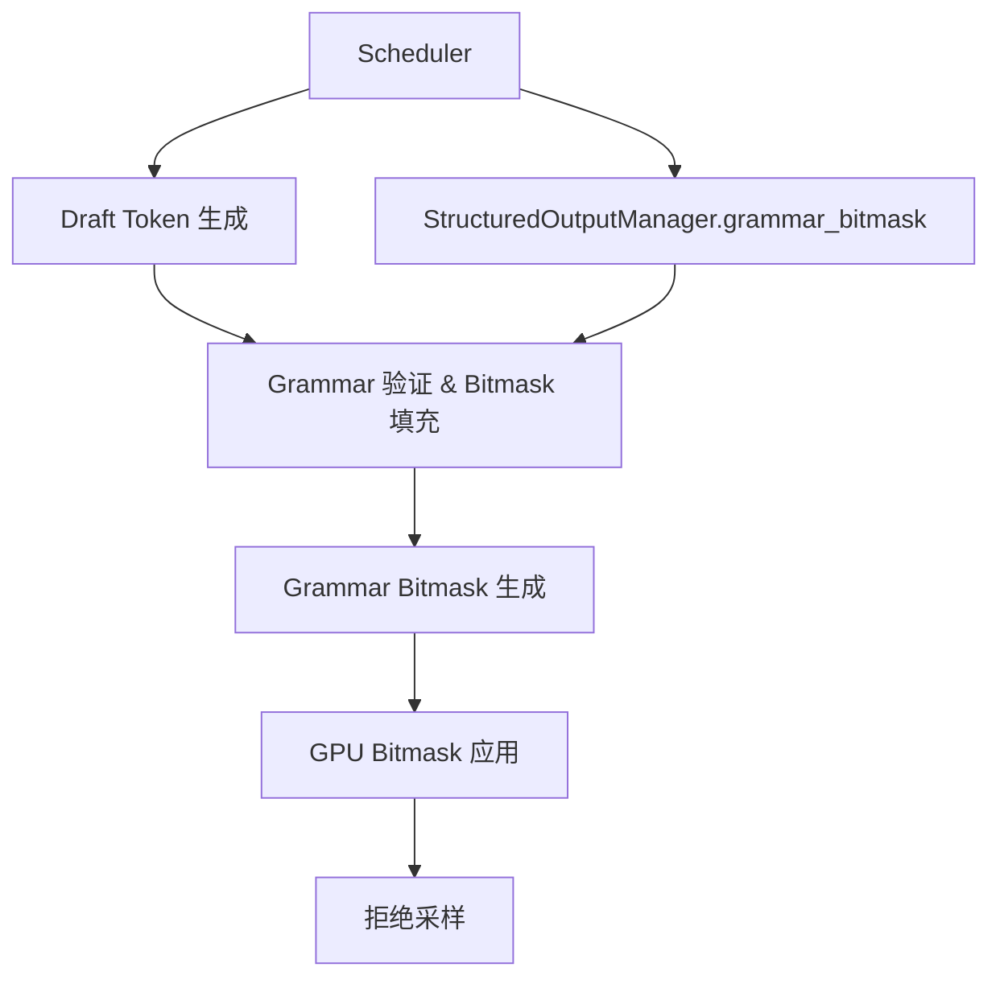

# vLLM Speculative Decoding 分析报告

> 生成日期：2026-07-26
> 代码版本：vLLM main (30b071403)

## 目录

1. [概述](#1-概述)
   - [1.1 核心能力](#11-核心能力)
   - [1.2 代码规模](#12-代码规模)
2. [架构总览](#2-架构总览)
   - [2.1 分层架构](#21-分层架构)
   - [2.2 核心工作流](#22-核心工作流)
   - [2.3 推测方法对比](#23-推测方法对比)
   - [2.4 拒绝采样方法](#24-拒绝采样方法)
3. [关键组件分析](#3-关键组件分析)
   - [3.1 SpeculativeConfig](#31-speculativeconfig)
   - [3.2 SpecDecodeBaseProposer](#32-specdecodebaseproposer)
   - [3.3 RejectionSampler](#33-rejectionsampler)
   - [3.4 N-gram 提案器](#34-n-gram-提案器)
   - [3.5 动态推测解码](#35-动态推测解码)
   - [3.6 Metrics 监控](#36-metrics-监控)
4. [Spec Decode + Structured Output 集成](#4-spec-decode--structured-output-集成)
   - [4.1 集成架构](#41-集成架构)
   - [4.2 核心机制](#42-核心机制)
   - [4.3 测试覆盖](#43-测试覆盖)
   - [4.4 关键设计决策](#44-关键设计决策)
5. [竞品分析：SGLang](#5-竞品分析sglang)
   - [5.1 SGLang Speculative Decoding 架构](#51-sglang-speculative-decoding-架构)
   - [5.2 vLLM vs SGLang 对比](#52-vllm-vs-sglang-对比)
   - [5.3 SGLang 可借鉴的设计](#53-sglang-可借鉴的设计)
6. [现存问题](#6-现存问题)
   - [6.1 Structured Output + Spec Decode 性能问题](#61-structured-output--spec-decode-性能问题)
   - [6.2 N-gram CPU 性能瓶颈](#62-n-gram-cpu-性能瓶颈)
   - [6.3 Draft 模型加载时间长](#63-draft-模型加载时间长)
   - [6.4 缺少 Jump-Forward Decoding](#64-缺少-jump-forward-decoding)
   - [6.5 缺少 Grammar-aware Speculation](#65-缺少-grammar-aware-speculation)
   - [6.6 动态推测策略单一](#66-动态推测策略单一)
   - [6.7 异构词表支持不完善](#67-异构词表支持不完善)
   - [6.8 缺少 Spec Decode 的 Benchmark 框架](#68-缺少-spec-decode-的-benchmark-框架)
7. [贡献方向](#7-贡献方向)
   - [P0：高优先级](#p0高优先级)
   - [P1：中优先级](#p1中优先级)
   - [P2：低优先级](#p2低优先级)
   - [P3：远期](#p3远期)
8. [6 个月路线图](#8-6-个月路线图)
   - [Phase 1：性能优化](#phase-1性能优化1-2-月)
   - [Phase 2：功能增强](#phase-2功能增强2-3-月)
   - [Phase 3：深度集成](#phase-3深度集成3-5-月)
   - [Phase 4：高级特性](#phase-4高级特性5-6-月)

## 1. 概述

Speculative Decoding（推测解码）是一种加速 LLM 推理的技术，通过使用一个轻量级的 draft model（草稿模型）先快速生成候选 token，再用 target model（目标模型）并行验证这些候选 token，从而实现与目标模型质量等价的加速效果。

vLLM 的 Speculative Decoding 实现非常全面，支持多种草案生成策略和拒绝采样方法，是业界最完整的开源实现之一。

### 1.1 核心能力

- **MTP (Multi-Token Prediction)**：多 token 预测头，支持 30+ 模型架构
- **EAGLE / EAGLE3**：基于特征层的推测解码
- **N-gram**：基于 prompt 匹配的零成本推测（CPU 和 GPU 两种实现）
- **Medusa**：基于 Medusa head 的并行推测
- **Draft Model**：独立的小模型作为 draft
- **DFlash**：面向 DFlash 模型的推测解码
- **DSpark**：面向 DeepSeek 的 block-level 推测解码
- **Suffix Decoding**：基于后缀树的推测解码
- **Extract Hidden States**：提取中间层特征用于推测
- **Structured Output 集成**：在推测解码中支持 grammar 约束

### 1.2 代码规模

| 模块 | 文件数 | 代码行数 |
|------|--------|----------|
| spec_decode 引擎 | 19 | ~6,005 |
| GPU worker spec_decode | 20+ | ~4,183 |
| 配置 | 1 | ~1,363 |
| 测试 | 21 | ~5,165 |
| **总计** | **~60** | **~16,716** |

---

## 2. 架构总览

### 2.1 分层架构

```
┌─────────────────────────────────────────────────────────────────┐
│                        Config Layer                              │
│  SpeculativeConfig (vllm/config/speculative.py)                  │
│  方法选择、参数配置、draft model 初始化                          │
├─────────────────────────────────────────────────────────────────┤
│                     Scheduling Layer                              │
│  Scheduler (vllm/v1/core/sched/scheduler.py)                     │
│  管理 spec decode 状态、token 预算、请求调度                     │
│  get_grammar_bitmask() 集成结构化输出                            │
├─────────────────────────────────────────────────────────────────┤
│                    Proposer Layer                                 │
│  SpecDecodeBaseProposer (vllm/v1/spec_decode/llm_base_proposer)  │
│  草案生成：forward draft model → 生成候选 token                  │
│  策略：MTP / EAGLE / Ngram / Medusa / Suffix                    │
├─────────────────────────────────────────────────────────────────┤
│                   Verification Layer                              │
│  RejectionSampler (vllm/v1/worker/gpu/spec_decode/)              │
│  拒绝采样：验证 draft token，选择接受/拒绝                       │
│  方法：standard / synthetic / block                              │
├─────────────────────────────────────────────────────────────────┤
│                   Integration Layer                               │
│  StructuredOutput + Spec Decode                                  │
│  max_rollback_tokens, draft token 模拟, bitmask 填充             │
└─────────────────────────────────────────────────────────────────┘
```

### 2.2 核心工作流



### 2.3 推测方法对比

| 方法 | 配置名称 | 是否需要额外模型 | 推理方式 | 适用场景 |
|------|----------|------------------|----------|----------|
| N-gram | `ngram` | 否 | 基于 prompt 匹配 | 通用，零成本 |
| N-gram GPU | `ngram_gpu` | 否 | GPU 加速匹配 | 通用，更高吞吐 |
| MTP | `mtp` | 是（模型内置） | 多 token 预测头 | DeepSeek、Qwen 等 |
| EAGLE | `eagle` | 是（独立权重） | 特征层推测 | 通用加速 |
| EAGLE3 | `eagle3` | 是（独立权重） | 特征层推测 | 更高加速比 |
| Medusa | `medusa` | 是（独立权重） | 并行 head | 通用加速 |
| MLP Speculator | `mlp_speculator` | 是（独立权重） | 并行 head | 配置保留，V1 未实现 |
| DFlash | `dflash` | 是（模型内置） | 非因果注意力 | 特定模型 |
| DSpark | `dspark` | 是（模型内置） | Block-level | DeepSeek |
| Suffix | `suffix` | 否 | 后缀树匹配 | 通用 |
| Draft Model | `draft_model` | 是（独立小模型） | 完整前向 | 通用加速 |
| Extract Hidden States | `extract_hidden_states` | 否（复用 target） | 提取中间层特征 | EAGLE/EAGLE3 的依赖组件 |
| Custom Class | `custom_class` | 用户自定义 | 用户定义 | 实验性 |

### 2.4 拒绝采样方法

| 方法 | 配置值 | 说明 |
|------|--------|------|
| Standard | `standard` | 标准概率比拒绝采样 |
| Synthetic | `synthetic` | 使用合成接受率（无真实 draft logits） |
| Block | `block` | 块验证（Sun et al.），联合验证所有 draft token |

---

## 3. 关键组件分析

### 3.1 SpeculativeConfig (`vllm/config/speculative.py`)

核心配置类，管理所有推测解码参数：

- **方法检测**：自动根据模型名称检测推测方法（EAGLE、EAGLE3、DFlash、DSpark 等）
- **Draft 模型加载**：加载独立 draft 模型权重
- **TP 对齐**：处理 target 和 draft 模型的 TP 配置
- **异构词表**：支持 target 和 draft 使用不同 tokenizer
- **动态推测**：根据 batch size 动态调整推测 token 数量

关键方法：
```python
class SpeculativeConfig:
    method: SpeculativeMethod  # ngram / mtp / eagle / etc.
    num_speculative_tokens: int  # 推测 token 数量
    model: str | None  # draft 模型名称
    prompt_lookup_max: int  # ngram 最大窗口
    rejection_sample_method: RejectionSampleMethod  # 拒绝采样方法
    draft_sample_method: DraftSampleMethod  # 草案采样方法
    parallel_drafting: bool  # 并行草案生成
    use_heterogeneous_vocab: bool  # 异构词表
```

### 3.2 SpecDecodeBaseProposer (`vllm/v1/spec_decode/llm_base_proposer.py`)

草案生成器基类，是所有推测方法的核心：

```python
class SpecDecodeBaseProposer:
    def __init__(self, vllm_config, device, ...)
    def _get_model(self) -> nn.Module  # 加载 draft 模型
    def set_inputs_first_pass(self, ...)  # 第一次前向
    def set_inputs_autoregressive(self, ...)  # 自回归前向
    def build_model_inputs_first_pass(self, ...)  # 构建输入
    def build_model_inputs_autoregressive(self, ...)  # 构建自回归输入
    def propose(self, ...) -> int  # 生成 draft token
```

子类：
- `MTPSpeculator` → 继承 `AutoRegressiveSpeculator` (`vllm/v1/worker/gpu/spec_decode/mtp/`)
- `EagleProposer` (`vllm/v1/spec_decode/eagle.py`)
- `DFlashProposer` (`vllm/v1/spec_decode/dflash.py`)
- `Gemma4Proposer` (`vllm/v1/spec_decode/gemma4.py`)
- `DraftModelProposer` (`vllm/v1/spec_decode/draft_model.py`)
- `NgramProposer` (`vllm/v1/spec_decode/ngram_proposer.py`)
- `NgramProposerGPU` (`vllm/v1/spec_decode/ngram_proposer_gpu.py`)
- `MedusaProposer` (`vllm/v1/spec_decode/medusa.py`)
- `SuffixDecodingProposer` (`vllm/v1/spec_decode/suffix_decoding.py`)
- `ExtractHiddenStatesProposer` (`vllm/v1/spec_decode/extract_hidden_states.py`)
- `Step3p5MTPProposer` (`vllm/v1/spec_decode/step3p5.py`)

### 3.3 RejectionSampler (`vllm/v1/worker/gpu/spec_decode/rejection_sampler.py`)

拒绝采样器，验证 draft token 是否被接受：

- **Standard rejection sampling**：使用概率比测试（Triton kernel）
- **Synthetic rejection sampling**：使用预配置的接受率曲线
- **Block verification**：联合验证所有 draft token
- **Chunking**：超过 1GB 的 logits 分块处理

核心 Triton kernel：
```python
def rejection_sample(
    target_logits,        # [num_logits, V]
    draft_logits,         # [max_num_reqs, num_spec_steps, V] | None
    draft_sampled,        # [num_logits]
    cu_num_logits,        # [num_reqs + 1]
    temperature,          # [max_num_reqs]
    seed,                 # [max_num_reqs]
    num_speculative_steps,
    synthetic_conditional_rates=None,  # synthetic rejection 用
    use_block_verification=False,
) -> (accepted_token_ids, num_accepted):

### 3.4 N-gram 提案器

**CPU 版本** (`vllm/v1/spec_decode/ngram_proposer.py`)：
- 使用 Numba JIT 加速
- 在 CPU 上执行 n-gram 匹配
- 受限于单线程（`num_numba_thread_available = min(1, cpu_count // 2)` 硬编码为 1）

**GPU 版本** (`vllm/v1/spec_decode/ngram_proposer_gpu.py`)：
- 使用 PyTorch 纯 GPU 操作
- `NgramGPUKernel` 使用 `torch.compile` 编译
- 支持 `torch.compile` 动态 shape

### 3.5 动态推测解码 (`vllm/v1/spec_decode/dynamic/`)

根据 batch size 动态调整推测 token 数量：
```python
num_speculative_tokens_per_batch_size = [
    (0, 4, 5),    # batch 0-4 时使用 5 个 spec tokens
    (5, 16, 3),   # batch 5-16 时使用 3 个
    (17, 32, 1),  # batch 17-32 时使用 1 个
]
```

### 3.6 Metrics 监控 (`vllm/v1/spec_decode/metrics.py`)

```python
class SpecDecodingStats:
    num_spec_tokens: int      # 配置的推测 token 数
    num_drafts: int           # 草案次数
    num_draft_tokens: int     # 草案 token 总数
    num_accepted_tokens: int  # 接受 token 总数
    # 每个位置的接受率统计
    num_accepted_tokens_per_pos: list[int]
    num_draft_tokens_per_pos: list[int]
```

---

## 4. Spec Decode + Structured Output 集成

### 4.1 集成架构



### 4.2 核心机制

**`grammar_bitmask()` 方法** (`vllm/v1/structured_output/__init__.py:212`)：

```python
def grammar_bitmask(
    self,
    requests: dict[str, Request],
    structured_output_request_ids: list[str],
    scheduled_spec_decode_tokens: dict[str, list[int]],
) -> npt.NDArray[np.int32] | None:
```

- 为每个 draft token 位置生成 bitmask
- 支持 `-1` 填充的无效 draft token
- 支持 reasoning 结束标记检测
- 返回 `N+1` 行 bitmask（N 个 draft + 1 个 bonus token）

**关键实现细节**：

1. **Draft token 模拟**：通过 `accept_tokens()` 模拟接受 draft token，然后 `rollback()` 回滚
2. **无效 draft 处理**：`-1` 标记的 draft token 跳过 grammar 推进
3. **Reasoning 处理**：检测 `reasoning_end` 标记，切换约束状态
4. **Bonus token**：始终为 bonus token 保留一个 bitmask 位置

### 4.3 测试覆盖 (`tests/v1/spec_decode/test_mtp_structured_output.py`)

| 测试 | 说明 |
|------|------|
| `test_bitmask_with_padded_invalid_drafts` | -1 填充的 draft 正确处理 |
| `test_bitmask_when_grammar_terminates_mid_window` | EOS 终止 grammar 后的 draft |
| `test_bitmask_idempotent_across_calls` | 相同输入返回相同 bitmask |
| `test_bonus_position_constrained_after_invalid_drafts` | -1 填充后 bonus 仍被约束 |
| `test_bitmask_constrained_when_reasoning_ends_midwindow` | reasoning 标记在 draft 中 |
| `test_bitmask_post_reasoning_end_drafts_skip_grammar_advance` | 标记后 draft 跳过 |
| `test_validate_tokens_then_bitmask_round_trip` | validate_tokens 往返 |
| `test_should_advance_records_reasoning_end_index` | 记录 reasoning 结束位置 |
| `test_trim_reasoning_for_advance` | 裁剪 reasoning 内容 |

### 4.4 关键设计决策

1. **`max_rollback_tokens`**：在各 backend 的 `compile_grammar()` 中设置（如 xgrammar 的 `max_rollback_tokens=self.num_speculative_tokens`），控制 grammar 回滚的最大 token 数
2. **`validate_tokens()`**：`StructuredOutputGrammar` 的方法，验证 draft token 的有效性，不会推进 FSM
3. **`accept_tokens()`**：接受多个 token 并推进 grammar 状态
4. **bitmask 形状**：`(batch_size * (1 + max_num_spec_tokens), vocab_size)`

---

## 5. 竞品分析：SGLang

### 5.1 SGLang Speculative Decoding 架构

SGLang 的推测解码架构与 vLLM 有显著差异：

**核心差异**：
- SGLang 使用 `SpecWorker` 架构，draft 和 target 模型在不同 worker 中运行
- 支持 `eagle`、`eagle3`、`ngram`、`mtp`（frozen_kv_mtp）等方法
- 没有独立的 rejection sampler 模块，拒绝采样逻辑分散在各 worker 中
- 草案生成和验证在同一进程内完成

### 5.2 vLLM vs SGLang 对比

| 维度 | vLLM | SGLang |
|------|------|--------|
| Draft 策略数 | 11+ | 7+ |
| GPU N-gram | 支持（Triton kernel） | 支持 |
| MTP 模型支持 | 30+ 架构 | 10+ 架构 |
| 动态推测 | 支持（batch 大小调整） | 支持（adaptive） |
| 结构化输出集成 | 完善（test_mtp_structured_output） | 实验性 |
| Rejection sampling | 3 种方法（standard/synthetic/block） | 2 种 |
| 异构词表 | 支持 | 不支持 |
| 并行草案 | 支持（EAGLE/DFlash/DSpark） | 部分支持 |
| 后缀匹配 | 支持（Suffix Decoding） | 不支持 |
| 自定义提案器 | 支持（custom_class） | 不支持 |
| Metrics | Prometheus 指标 | 基础日志 |
| 测试覆盖 | 21 个测试文件，~5,165 行 | ~10 个测试文件 |
| 代码规模 | ~16,716 行 | ~21,920 行 |

### 5.3 SGLang 可借鉴的设计

1. **Adaptive Runtime State** (`adaptive_runtime_state.py`)：SGLang 可以根据运行时状态动态调整推测策略
2. **EAGLE Disaggregation** (`eagle_disaggregation.py`)：SGLang 支持 EAGLE 的分离式部署
3. **Ragged Verify** (`ragged_verify.py`)：SGLang 的不规则验证可以减少 padding 开销
4. **DFlash Info V2** (`dflash_info_v2.py`)：SGLang 的 DFlash 信息管理更细粒度

---

## 6. 现存问题

### 6.1 Structured Output + Spec Decode 性能问题

**问题**：`grammar_bitmask()` 方法中，每个 draft token 都需要串行执行 `accept_tokens()` 和 `rollback()`，这在大量 draft token 时成为瓶颈。

**影响**：高推测 token 数场景下，bitmask 生成时间线性增长。

**建议**：优化为批量处理，减少串行操作。

### 6.2 N-gram CPU 性能瓶颈

**问题**：CPU N-gram 提案器使用 Numba JIT，但受限于单线程（`num_numba_thread_available = 1`）。

**影响**：大 batch 场景下，CPU N-gram 匹配成为瓶颈。

**建议**：默认使用 GPU N-gram 提案器，或增加 CPU 线程数。

### 6.3 Draft 模型加载时间长

**问题**：Draft 模型权重加载需要额外的模型加载时间，特别是在大模型场景下。

**影响**：启动时间增加，快速迭代调试困难。

**建议**：支持 draft 模型权重预加载和缓存。

### 6.4 缺少 Jump-Forward Decoding

**问题**：vLLM 不支持 Jump-Forward Decoding（SGLang 支持，通过 `try_jump_forward()`）。

**影响**：对于确定性 grammar（如 JSON schema），无法跳过已确定的 token 序列。

**建议**：在结构化输出后端添加 `try_jump_forward()` 支持。

### 6.5 缺少 Grammar-aware Speculation

**问题**：当前 draft 生成不考虑 grammar 约束，生成无效 draft token 的概率高。

**影响**：低接受率，spec decode 加速效果受限。

**建议**：在 draft 生成过程中考虑 grammar 约束（如 xgrammar 的 draft token 支持）。

### 6.6 动态推测策略单一

**问题**：动态推测仅根据 batch size 调整 token 数，没有考虑其他因素（如 sequence length、acceptance rate）。

**影响**：推测策略不够灵活，无法适应多样化的 workload。

**建议**：添加更多维度的动态调整策略。

### 6.7 异构词表支持不完善

**问题**：`use_heterogeneous_vocab` 仅支持 `draft_model` 方法，且要求 `draft_sample_method="greedy"`。

**影响**：限制了异构词表的使用场景。

**建议**：扩展异构词表支持到更多推测方法。

### 6.8 缺少 Spec Decode 的 Benchmark 框架

**问题**：没有统一的 spec decode 性能基准测试。

**影响**：难以量化不同推测方法的加速效果，难以进行回归测试。

**建议**：添加 spec decode benchmark 框架。

---

## 7. 贡献方向

### P0：高优先级

#### 7.1 Grammar-aware Speculation

**难度**：高 | **影响**：大 | **估计**：1-2 月

在 draft 生成过程中考虑 grammar 约束：
1. 在 draft 模型 forward 时应用 bitmask
2. 减少无效 draft token 的生成
3. 提高接受率

**参考**：xgrammar 的 `fill_next_token_bitmask_par_with_draft_tokens()` 函数（SGLang 已实现）。

#### 7.2 Structured Output + Spec Decode 性能优化

**难度**：中 | **影响**：大 | **估计**：2-3 周

优化 `grammar_bitmask()` 方法：
1. 批量处理 draft token 的 grammar 推进
2. 减少 `accept_tokens()` / `rollback()` 的调用次数
3. 使用并行 fill 减少 CPU 开销

#### 7.3 N-gram GPU 默认启用

**难度**：低 | **影响**：大 | **估计**：1 周

将默认 N-gram 实现从 CPU 切换到 GPU：
1. 默认使用 `NgramProposerGPU`
2. 保留 CPU 版本作为后备选项
3. 添加配置选项

### P1：中优先级

#### 7.4 Jump-Forward Decoding 支持

**难度**：中 | **影响**：大 | **估计**：3-4 周

在结构化输出后端添加 Jump-Forward Decoding：
1. 在 `StructuredOutputGrammar` 中添加 `try_jump_forward()` 方法
2. 在 scheduler 中调用
3. 支持 xgrammar 和 guidance 后端

**参考**：SGLang 的 `outlines_jump_forward.py` 和 `xgrammar_backend.py:try_jump_forward()`。

#### 7.5 多维动态推测策略

**难度**：中 | **影响**：中 | **估计**：2-3 周

扩展动态推测策略：
1. 结合 acceptance rate 动态调整
2. 考虑 sequence length
3. 考虑 grammar 约束程度

#### 7.6 Spec Decode Benchmark 框架

**难度**：低 | **影响**：高 | **估计**：1-2 周

添加 spec decode 基准测试框架：
1. 支持所有推测方法
2. 输出准确率和吞吐量指标
3. 支持回归测试

#### 7.7 Draft 模型加载优化

**难度**：中 | **影响**：中 | **估计**：2-3 周

优化 draft 模型加载：
1. 支持权重缓存
2. 支持异步加载
3. 减少启动时间

### P2：低优先级

#### 7.8 异构词表扩展

**难度**：中 | **影响**：中 | **估计**：2-3 周

扩展异构词表支持到更多推测方法：
1. MTP
2. EAGLE
3. Medusa

#### 7.9 Spec Decode + Tool Calling 集成

**难度**：高 | **影响**：大 | **估计**：1-2 月

在 spec decode 中支持 tool calling：
1. Draft token 验证时考虑 structural_tag 约束
2. 减少工具调用格式错误

#### 7.10 Spec Decode + Reasoning 集成

**难度**：中 | **影响**：中 | **估计**：2-3 周

在 reasoning 模式下优化 spec decode：
1. 推理阶段使用更激进的推测策略
2. 推理结束后切换到更保守的策略

#### 7.11 自适应推测策略

**难度**：高 | **影响**：大 | **估计**：1-2 月

根据运行时状态自动选择推测方法：
1. 监控 acceptance rate
2. 动态切换 ngram / draft model
3. 参考 SGLang 的 Adaptive Runtime State

#### 7.12 Spec Decode Metrics 增强

**难度**：低 | **影响**：中 | **估计**：1 周

添加更多 Prometheus 指标：
- `vllm_spec_decode_acceptance_rate`（接受率）
- `vllm_spec_decode_draft_latency_seconds`（草案生成延迟）
- `vllm_spec_decode_verification_latency_seconds`（验证延迟）
- `vllm_spec_decode_acceptance_rate_per_position`（每个位置接受率）

#### 7.13 Spec Decode + 多模态集成

**难度**：高 | **影响**：大 | **估计**：1-2 月

在多模态模型（如 Qwen3.5 VL）中支持 spec decode。

### P3：远期

#### 7.14 跨节点 Spec Decode

**难度**：高 | **影响**：大 | **估计**：2-3 月

支持 draft 模型和 target 模型分布在不同的节点上。

#### 7.15 Spec Decode 自动调优

**难度**：高 | **影响**：大 | **估计**：2-3 月

自动搜索最优的 spec decode 参数：
1. 推测 token 数
2. 拒绝采样方法
3. Draft 采样策略

#### 7.16 多 Draft 模型集成

**难度**：高 | **影响**：大 | **估计**：2-3 月

同时使用多个 draft 模型，选择最优结果。

#### 7.17 Spec Decode + Prefix Caching 集成

**难度**：中 | **影响**：中 | **估计**：2-3 周

优化 spec decode 与 prefix caching 的交互，避免重复计算。

---

## 8. 6 个月路线图

### Phase 1：性能优化（1-2 月）

| PR | 内容 | 估计 |
|----|------|------|
| 1 | N-gram GPU 默认启用 | 1 周 |
| 2 | Structured Output + Spec Decode 性能优化 | 2-3 周 |
| 3 | Spec Decode Benchmark 框架 | 1-2 周 |
| 4 | Spec Decode Metrics 增强 | 1 周 |

### Phase 2：功能增强（2-3 月）

| PR | 内容 | 估计 |
|----|------|------|
| 5 | Jump-Forward Decoding 支持 | 3-4 周 |
| 6 | 多维动态推测策略 | 2-3 周 |
| 7 | 异构词表扩展 | 2-3 周 |
| 8 | Draft 模型加载优化 | 2-3 周 |

### Phase 3：深度集成（3-5 月）

| PR | 内容 | 估计 |
|----|------|------|
| 9 | Grammar-aware Speculation | 1-2 月 |
| 10 | Spec Decode + Tool Calling 集成 | 1-2 月 |
| 11 | Spec Decode + Reasoning 集成 | 2-3 周 |
| 12 | Spec Decode + 多模态集成 | 1-2 月 |

### Phase 4：高级特性（5-6 月）

| PR | 内容 | 估计 |
|----|------|------|
| 13 | 自适应推测策略 | 1-2 月 |
| 14 | Spec Decode 自动调优 | 2-3 月 |
| 15 | 多 Draft 模型集成 | 2-3 月 |

---

## 附录 A：相关文件列表

### 引擎层
| 文件 | 说明 |
|------|------|
| `vllm/v1/spec_decode/llm_base_proposer.py` | 草案生成器基类 |
| `vllm/v1/spec_decode/draft_model.py` | Draft Model 提案器 |
| `vllm/v1/spec_decode/ngram_proposer.py` | CPU N-gram 提案器 |
| `vllm/v1/spec_decode/ngram_proposer_gpu.py` | GPU N-gram 提案器 |
| `vllm/v1/spec_decode/medusa.py` | Medusa 提案器 |
| `vllm/v1/spec_decode/eagle.py` | EAGLE 提案器 |
| `vllm/v1/spec_decode/dflash.py` | DFlash 提案器 |
| `vllm/v1/spec_decode/step3p5.py` | Step3.5 提案器 |
| `vllm/v1/spec_decode/gemma4.py` | Gemma4 提案器 |
| `vllm/v1/spec_decode/suffix_decoding.py` | 后缀解码提案器 |
| `vllm/v1/spec_decode/custom_class_proposer.py` | 自定义提案器 |
| `vllm/v1/spec_decode/utils.py` | 工具函数和 Triton kernels |
| `vllm/v1/spec_decode/vocab_mapping.py` | 异构词表映射 |
| `vllm/v1/spec_decode/metrics.py` | 指标监控 |
| `vllm/v1/spec_decode/metadata.py` | 元数据结构 |
| `vllm/v1/spec_decode/extract_hidden_states.py` | 隐藏状态提取 |
| `vllm/v1/spec_decode/dynamic/` | 动态推测解码 |

### GPU Worker 层
| 文件 | 说明 |
|------|------|
| `vllm/v1/worker/gpu/spec_decode/speculator.py` | 基类 Speculator |
| `vllm/v1/worker/gpu/spec_decode/rejection_sampler.py` | 拒绝采样器 |
| `vllm/v1/worker/gpu/spec_decode/rejection_sampler_utils.py` | 拒绝采样 Triton kernels |
| `vllm/v1/worker/gpu/spec_decode/autoregressive/` | 自回归 Speculator |
| `vllm/v1/worker/gpu/spec_decode/mtp/` | MTP Speculator |
| `vllm/v1/worker/gpu/spec_decode/eagle/` | EAGLE Speculator |
| `vllm/v1/worker/gpu/spec_decode/dflash/` | DFlash Speculator |
| `vllm/v1/worker/gpu/spec_decode/dspark/` | DSpark Speculator |
| `vllm/v1/worker/gpu/spec_decode/gemma4/` | Gemma4 Speculator |
| `vllm/v1/worker/gpu/spec_decode/utils.py` | 工具函数 |

### 配置
| 文件 | 说明 |
|------|------|
| `vllm/config/speculative.py` | SpeculativeConfig 配置类 |

### 测试
| 文件 | 说明 |
|------|------|
| `tests/v1/spec_decode/test_eagle.py` | EAGLE 测试 |
| `tests/v1/spec_decode/test_mtp.py` | MTP 测试 |
| `tests/v1/spec_decode/test_mtp_structured_output.py` | MTP + 结构化输出集成测试 |
| `tests/v1/spec_decode/test_ngram.py` | N-gram 测试 |
| `tests/v1/spec_decode/test_rejection_sampler_utils.py` | 拒绝采样测试 |
| `tests/v1/spec_decode/test_speculators_correctness.py` | 正确性测试 |
| `tests/v1/spec_decode/test_dynamic_sd.py` | 动态推测测试 |
| `tests/v1/spec_decode/test_acceptance_length.py` | 接受长度测试 |
| `tests/v1/spec_decode/test_dflash_lookahead.py` | DFlash 测试 |
| `tests/v1/spec_decode/test_synthetic_rejection_sampler_utils.py` | 合成拒绝采样测试 |
| `tests/v1/spec_decode/test_vocab_mapping.py` | 词表映射测试 |
| `tests/v1/spec_decode/test_extract_hidden_states.py` | 隐藏状态提取测试 |

---

## 附录 B：环境变量

vLLM 的 Speculative Decoding 没有专用的环境变量，所有配置通过 `SpeculativeConfig` 参数传递。关键命令行参数：

| 参数 | 默认值 | 说明 |
|------|--------|------|
| `--speculative-model` | `None` | Draft 模型名称 |
| `--num-speculative-tokens` | 取决于 draft 模型 | 推测 token 数 |
| `--speculative-method` | 自动检测 | 推测方法 |
| `--speculative-draft-tensor-parallel-size` | 同 target TP | Draft 模型 TP 大小 |
| `--rejection-sampling-method` | `standard` | 拒绝采样方法 |
| `--prompt-lookup-max` | 5 | Ngram 最大窗口 |
| `--prompt-lookup-min` | 5 | Ngram 最小窗口 |

---

## 附录 C：架构图

### 推测解码数据流

```
输入请求
    │
    ▼
Scheduler 决策
    │
    ├── 是否启用 Spec Decode？
    │   ├── 否 → 标准解码
    │   └── 是 → 继续
    │
    ▼
Proposer 生成 Draft Tokens
    │
    ├── Ngram → CPU/GPU N-gram 匹配
    ├── MTP → MTP head 前向传播
    ├── EAGLE → 特征层推测
    ├── Medusa → Medusa head 并行生成
    ├── Draft Model → 小模型完整前向
    └── Suffix → 后缀树匹配
    │
    ▼
Grammar Bitmask 生成
    │
    ├── 每个 draft token 位置生成 bitmask
    ├── 处理 -1 无效 draft
    └── 处理 reasoning 结束标记
    │
    ▼
Target Model 验证
    │
    ├── 并行计算 target logits
    └── 应用 grammar bitmask
    │
    ▼
Rejection Sampling
    │
    ├── Standard: 概率比测试
    ├── Synthetic: 合成接受率
    └── Block: 联合验证
    │
    ▼
更新状态
    │
    ├── 接受 token → 添加到输出
    ├── 拒绝 token → 回退到 target 采样
    └── 更新统计指标
```