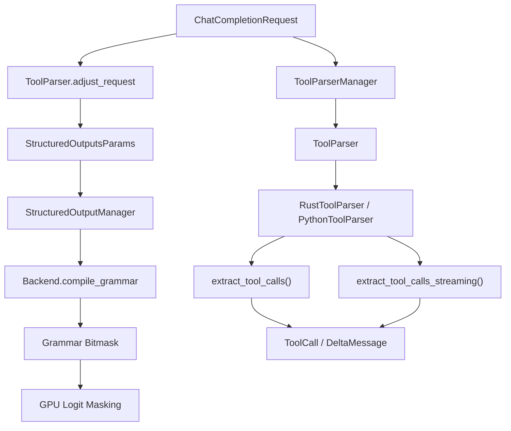
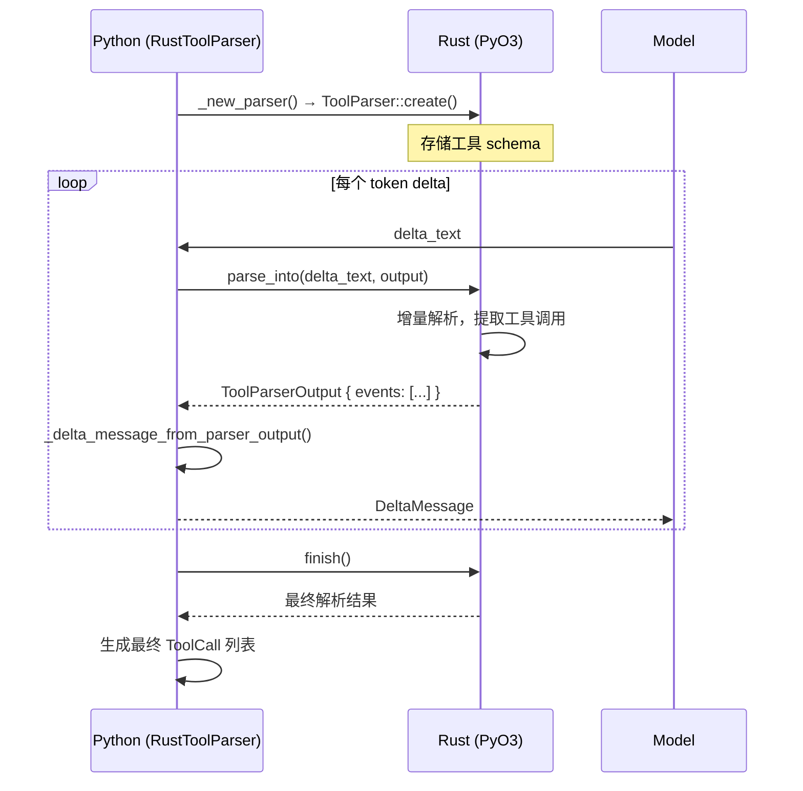

# vLLM Tool Calling 分析报告

> 生成日期：2026-07-26
> 代码版本：vLLM main (30b071403)

## 目录

1. [概述](#1-概述)
   - [1.1 核心能力](#11-核心能力)
   - [1.2 代码规模](#12-代码规模)
2. [架构总览](#2-架构总览)
   - [2.1 分层架构](#21-分层架构)
   - [2.2 核心组件关系](#22-核心组件关系)
   - [2.3 双解析引擎架构](#23-双解析引擎架构)
   - [2.4 模型格式支持矩阵](#24-模型格式支持矩阵)
3. [数据流详解](#3-数据流详解)
   - [3.1 非流式工具调用](#31-非流式工具调用)
   - [3.2 流式工具调用](#32-流式工具调用)
   - [3.3 严格工具调用](#33-严格工具调用-strict-tool-calling)
   - [3.4 Rust 解析器数据流](#34-rust-解析器数据流)
4. [关键组件分析](#4-关键组件分析)
   - [4.1 ToolParser 抽象基类](#41-toolparser-抽象基类)
   - [4.2 RustToolParser 适配器](#42-rusttoolparser-适配器)
   - [4.3 Rust 端 ToolParser trait](#43-rust-端-toolparser-trait)
   - [4.4 结构化标签注册表](#44-结构化标签注册表)
   - [4.5 流式处理](#45-流式处理)
5. [竞品分析：SGLang](#5-竞品分析sglang)
   - [5.1 SGLang 工具调用架构](#51-sglang-工具调用架构)
   - [5.2 vLLM vs SGLang 对比](#52-vllm-vs-sglang-对比)
   - [5.3 SGLang 可借鉴的设计](#53-sglang-可借鉴的设计)
6. [现存问题](#6-现存问题)
   - [6.1 Rust 解析器覆盖不全](#61-rust-解析器覆盖不全pyo3-注册不足)
   - [6.2 structural_tag 模型与解析器不匹配](#62-structural_tag-模型与解析器不匹配)
   - [6.3 流式解析状态管理复杂](#63-流式解析状态管理复杂)
   - [6.4 缺少工具调用验证](#64-缺少工具调用验证)
   - [6.5 多轮工具调用支持有限](#65-多轮工具调用支持有限)
   - [6.6 缺少工具调用性能指标](#66-缺少工具调用性能指标)
   - [6.7 工具定义格式不统一](#67-工具定义格式不统一)
   - [6.8 缺少工具调用的结构化输出测试](#68-缺少工具调用的结构化输出测试)
7. [贡献方向](#7-贡献方向)
   - [P0：高优先级](#p0高优先级)
   - [P1：中优先级](#p1中优先级)
   - [P2：低优先级](#p2低优先级)
   - [P3：远期](#p3远期)
8. [6 个月路线图](#8-6-个月路线图)
   - [Phase 1：基础设施](#phase-1基础设施1-2-月)
   - [Phase 2：核心功能](#phase-2核心功能2-3-月)
   - [Phase 3：PyO3 注册与 Rust 解析器启用](#phase-3pyo3-注册与-rust-解析器启用3-5-月)
   - [Phase 4：高级功能](#phase-4高级功能5-6-月)

## 1. 概述

Tool Calling（函数调用）是 LLM 服务中最重要的能力之一。它允许模型在生成过程中调用外部工具（如搜索引擎、计算器、数据库查询等），是大模型从"对话机器人"升级为"智能体"的关键基础设施。

vLLM 的 Tool Calling 实现经历了从纯 Python 到 Rust+Python 混合架构的演进。当前架构以 **Rust 原生解析器**为核心，结合 **xgrammar structural_tag** 实现严格的工具调用格式约束，支持 30+ 种模型特定的工具调用格式。

### 1.1 核心能力

- **30+ 模型格式支持**：Hermes、Llama、Mistral、Qwen、DeepSeek、Kimi、GLM、MiniMax 等
- **双语言解析引擎**：Rust 原生解析器 + Python 解析器
- **严格工具调用**：通过 xgrammar structural_tag 实现 GPU 级格式约束
- **并行工具调用**：单次生成多个工具调用
- **流式工具调用**：支持 SSE 流式输出 delta 消息
- **工具选择**：`auto` / `required` / `none` / `named function`
- **Responses API**：支持 OpenAI Responses API 的函数工具

### 1.2 代码规模

| 模块 | 文件数 | 代码行数 |
|------|--------|----------|
| Python Tool Parsers | 40+ | ~13,650 |
| Rust Tool Parsers | 20+ | ~10,647 |
| 结构化标签注册表 | 1 | ~347 |
| 抽象基类 | 1 | ~378 |
| 测试 | 45+ | ~18,000 |
| **总计** | **70+** | **~28,000** |

---

## 2. 架构总览

### 2.1 分层架构

```
┌─────────────────────────────────────────────────────────────┐
│                     Frontend Layer                          │
│  Rust: routes/openai/chat_completions.rs                    │
│  Python: entrypoints/openai/chat_completion/               │
│  接收 HTTP 请求，解析 tools / tool_choice 参数              │
│  调用 adjust_request() 设置结构化输出约束                    │
├─────────────────────────────────────────────────────────────┤
│                     Parser Layer                             │
│  Rust: parser/src/tool/  (原生解析器)                       │
│  Python: tool_parsers/     (Python 解析器)                  │
│  流式/非流式解析工具调用，输出 ToolCallDelta                 │
├─────────────────────────────────────────────────────────────┤
│                  Constraint Layer                            │
│  structural_tag_registry.py → xgrammar StructuralTag        │
│  通过 vllm/v1/structured_output/ 生成 GPU bitmask           │
│  约束模型输出格式，确保符合工具调用 schema                   │
├─────────────────────────────────────────────────────────────┤
│                  Serving Layer                               │
│  entrypoints/openai/chat_completion/                        │
│  将 ToolCallDelta 转换为 OpenAI 协议格式                     │
│  处理流式 delta 消息聚合                                    │
└─────────────────────────────────────────────────────────────┘
```

### 2.2 核心组件关系



### 2.3 双解析引擎架构

vLLM 支持两种工具调用解析方式：

**Python 解析器**（传统方式）：
- `ToolParser` 基类提供 `extract_tool_calls()` 和 `extract_tool_calls_streaming()` 抽象方法
- 每个模型格式实现自己的子类
- 通过 `ToolParserManager` 注册和管理
- 适用于：Hermes、Llama、Mistral 等 JSON 格式

**Rust 原生解析器**（新方式）：
- `RustToolParser` 适配器桥接 vLLM 与 Rust 解析器
- Rust 端实现 `ToolParser` trait，提供增量解析
- 通过 `PyO3` 绑定到 Python（目前仅注册了 MinimaxM3、DeepSeek V4、Kimi K2 三个解析器）
- 适用于：Kimi K2、MiniMax M3、DeepSeek V4 等

### 2.4 模型格式支持矩阵

| 模型 | 解析器 | 语言 | 格式类型 | strict tag | 备注 |
|------|--------|------|----------|------------|------|
| Hermes | Hermes2ProToolParser | Python | JSON | hermes | Rust 端有 dormant 实现但未通过 PyO3 暴露 |
| Llama 3 | Llama3JsonToolParser | Rust | JSON | llama | Rust 代码已定义，但需通过 PyO3 注册 |
| Mistral | MistralToolParser | Python | JSON | - | Rust 端有 dormant 实现但未通过 PyO3 暴露 |
| Qwen 3 | Qwen3XmlToolParser | Rust | XML | qwen_3 | Rust 解析器，需通过 PyO3 注册 |
| Qwen 3 Coder | Qwen3CoderToolParser | Rust | XML+custom | qwen_3_coder | Rust 解析器，需通过 PyO3 注册 |
| DeepSeek V3 | DeepSeekV3ToolParser | Rust | JSON | deepseek_v3_1 | Rust 解析器，需通过 PyO3 注册 |
| DeepSeek V31 | DeepSeekV31ToolParser | Rust | JSON | deepseek_v3_1 | Rust 解析器，需通过 PyO3 注册 |
| DeepSeek V32 | DeepSeekV32ToolParser | Rust | DSML | deepseek_v3_2 | Rust 解析器，需通过 PyO3 注册 |
| DeepSeek V4 | DeepSeekV4ToolParser | Rust | DSML | deepseek_v4 | 已通过 PyO3 注册 |
| Kimi K2 | KimiK2ToolParser | Rust | XML | kimi | 已通过 PyO3 注册 |
| GLM | Glm47MoeToolParser | Python | XML | glm_4_7 | Rust 端有 dormant 实现但未通过 PyO3 暴露 |
| MiniMax M3 | MinimaxM3ToolParser | Rust | XML | minimax | 已通过 PyO3 注册 |
| InternLM2 | Internlm2ToolParser | Python | JSON | - | Rust 端有 dormant 实现但未通过 PyO3 暴露 |
| Phi4Mini | Phi4MiniJsonToolParser | Rust | JSON | - | Rust 解析器，需通过 PyO3 注册 |
| Granite4 | Granite4ToolParser | Rust | JSON | - | Rust 解析器，需通过 PyO3 注册 |

---

## 3. 数据流详解

### 3.1 非流式工具调用

```
1. 用户请求: POST /v1/chat/completions
   { tools: [...], tool_choice: "auto" }

2. Rust 前端 (chat_completions.rs)
   → 解析工具定义
   → 调用 convert_from_response_format()
   → 通过 ZMQ 发送到 EngineCore

3. EngineCore (Python)
   → ChatCompletionHandler.process_request()
   → ToolParserManager.get_tool_parser() 获取解析器
   → ToolParser.adjust_request() 设置结构化输出约束
   → 如果 strict 开启，生成 structural_tag 约束

4. 模型推理
   → GPU 生成 logits → bitmask 约束 → 采样
   → 生成完整文本

5. 非流式解析
   → ToolParser.extract_tool_calls(model_output)
   → 返回 ExtractedToolCallInformation
   → 转换为 OpenAI ChatCompletionMessage 格式

6. 响应
   ← { choices: [{ message: { content, tool_calls: [...] } }] }
```

### 3.2 流式工具调用

```
1. 同上 1-3

2. 模型推理 (逐 token 流式)
   → 每次生成一个 token delta

3. 流式解析
   → 每次 delta 到达时调用 ToolParser.extract_tool_calls_streaming()
   → 返回 DeltaMessage（包含 content 和/或 tool_calls delta）

4. SSE 响应
   ← data: { choices: [{ delta: { content: "..." } }] }
   ← data: { choices: [{ delta: { tool_calls: [{...}] } }] }
   ← data: [DONE]
```

### 3.3 严格工具调用 (Strict Tool Calling - Rust 解析器模式)

```
1. 环境变量: VLLM_ENFORCE_STRICT_TOOL_CALLING=true

2. ToolParser 初始化
   → structural_tag_builder() 返回 xgrammar StructuralTagBuilder
   → 或通过 structural_tag_registry 获取模型特定标签

3. RustToolParser.adjust_request()
   → 跳过 Python 端 JSON schema 约束（避免与 Rust 解析器冲突）
   → 让 Rust 解析器 + xgrammar structural_tag 负责格式约束

4. xgrammar 生成 structural_tag
   → 定义工具调用的合法格式 (begin/end 标记)
   → 转换为 GPU bitmask
   → 约束模型输出

5. 模型只能生成符合格式的输出
   → 减少格式错误
   → 提高工具调用成功率
```

> 注意：对于非 Rust 解析器（Python 解析器），严格模式通过 `adjust_request()` 设置 JSON schema 约束来实现，而非 structural_tag。

### 3.4 Rust 解析器数据流



---

## 4. 关键组件分析

### 4.1 ToolParser 抽象基类 (`vllm/tool_parsers/abstract_tool_parser.py`)

- **`ToolParser`**：基类，定义解析器接口
  - `supports_required_and_named`：是否支持标准 JSON required/named 解析
  - `structural_tag_model`：xgrammar 内置结构标签模型名
  - `engine_based_streaming`：是否使用引擎级流式解析
  - `adjust_request()`：调整请求参数，设置结构化输出约束
  - `get_structural_tag()`：获取 xgrammar structural_tag
  - `extract_tool_calls()`：非流式解析
  - `extract_tool_calls_streaming()`：流式解析

- **`ToolParserManager`**：解析器注册中心
  - 支持即时注册 (`register_module`) 和延迟注册 (`register_lazy_module`)
  - 延迟注册避免导入大量解析器模块
  - 支持插件式用户自定义解析器

### 4.2 RustToolParser 适配器 (`vllm/tool_parsers/rust_tool_parser.py`)

- 桥接 Python 和 Rust 解析器
- 关键设计：
  - `_new_parser()` 创建 Rust 解析器实例
  - `_get_parser()` 延迟初始化，跨请求重用
  - `_reset_streaming_state()` 为新请求重置状态
  - `_parse_complete()` 使用一次性解析器处理完整输出
  - `_delta_message_from_parser_output()` 转换 Rust 输出为 Python 协议

### 4.3 Rust 端 ToolParser trait (`rust/src/parser/src/tool/mod.rs`)

```rust
pub trait ToolParser: Send {
    fn create(tools: &[Tool]) -> Result<Box<dyn ToolParser>>;
    fn preserve_special_tokens(&self) -> bool;
    fn structural_tag_builder(&self) -> Option<&dyn StructuralTagBuilder>;
    fn tool_call_id(&self, tool_index: usize) -> Option<&str>;
    fn parse_into(&mut self, chunk: &str, output: &mut ToolParserOutput) -> Result<()>;
    fn finish(&mut self) -> Result<ToolParserOutput>;
    fn reset(&mut self) -> String;
}
```

- **`Tool`**：工具定义（name, description, parameters, strict）
- **`ToolCallDelta`**：增量工具调用（tool_index, name, arguments）
- **`ToolParserOutput`**：解析输出（events: Vec\<ToolParserEvent\>）

### 4.4 结构化标签注册表 (`vllm/tool_parsers/structural_tag_registry.py`)

- 管理 xgrammar 内置和 vLLM 自定义的 structural_tag 模型
- xgrammar 内置：`llama`, `kimi`, `deepseek_r1`, `deepseek_v3_1`, `qwen_3_5`, `qwen_3_coder`, `qwen_3`, `harmony`, `deepseek_v3_2`, `glm_4_7`, `deepseek_v4`
- vLLM 自定义：`hermes`, `minimax`
- `get_model_structural_tag()`：构建 xgrammar StructuralTag
- 当 `tool_choice="auto"` 且没有 strict 工具时，返回 `None`（不约束）

### 4.5 流式处理 (`vllm/tool_parsers/streaming.py`)

- 处理流式工具调用输出
- 维护 `prev_tool_call_arr` 和 `streamed_args_for_tool` 状态
- 支持 `get_remaining_unstreamed_args()` 取回未流式输出的参数

---

## 5. 竞品分析：SGLang

### 5.1 SGLang 工具调用架构

SGLang 的工具调用实现与 vLLM 有显著差异：

**核心差异**：
- SGLang 使用 `FunctionCallParser` + `BaseFormatDetector` 架构
- 解析器在 Python 中实现，而非 Rust
- 没有独立的 Rust 原生解析器
- 通过 `tool_call_parser` 参数指定模型格式

**注册方式**：
```python
class FunctionCallParser:
    ToolCallParserEnum = {
        "hermes": HermesDetector,
        "deepseekv3": DeepSeekV3Detector,
        "qwen": Qwen25Detector,
        # ... 30+ 格式
    }
```

### 5.2 vLLM vs SGLang 对比

| 维度 | vLLM | SGLang |
|------|------|--------|
| 解析引擎 | Rust 原生 + Python | 纯 Python |
| 格式约束 | xgrammar structural_tag | xgrammar structural_tag |
| 模型格式数 | 30+ | 30+ |
| 流式解析 | 增量 delta 解析 | 增量 streaming 解析 |
| 严格工具调用 | `VLLM_ENFORCE_STRICT_TOOL_CALLING` | `SGLANG_TOOL_STRICT_LEVEL` |
| 并行工具调用 | 支持 | 支持 |
| Responses API | 支持 | 部分支持 |
| Rust 实现 | 20 个实现（仅 3 个通过 PyO3 暴露） | 无 |
| 性能 | 更优（Rust 解析） | 中等（Python 解析） |
| 可扩展性 | 插件式注册 | 硬编码枚举 |

### 5.3 SGLang 可借鉴的设计

1. **`ToolStrictLevel` 分级控制**：SGLang 支持 `OFF` / `FUNCTION` / `PARAMETER` 三级严格模式，vLLM 只有开/关
2. **`tool_call_parser` 自动检测**：SGLang 支持根据模型自动选择解析器
3. **格式检测器注册**：每个 `BaseFormatDetector` 子类通过类变量自动注册

---

## 6. 现存问题

### 6.1 Rust 解析器覆盖不全（PyO3 注册不足）

**问题**：Rust 端定义了 20 个 `ToolParser` trait 实现，但通过 PyO3 暴露给 Python 的只有 3 个（MinimaxM3、DeepSeek V4、Kimi K2）。其余 17 个 Rust 解析器（Hermes、Mistral、InternLM2、Qwen3、GLM 等）处于"dormant"状态——有代码但没有被 Python 端使用。

**影响**：约 28 个模型格式仍在使用 Python 解析器，性能较差，且不支持 Rust 解析器的 `structural_tag_builder()` 接口，无法使用严格工具调用。

**建议**：优先将 Rust 端已存在的解析器通过 PyO3 `tool_parser_factory!` 宏注册到 Python 端，再逐步迁移剩余 Python 解析器。

### 6.2 structural_tag 模型与解析器不匹配

**问题**：`structural_tag_model` 和 `rust_parser_name` 是分离的字段，一些解析器设置了 `structural_tag_model` 但没有对应的 xgrammar 内置标签。

**影响**：严格工具调用可能无法正常工作，模型可能产生不符合格式的输出。

**建议**：建立解析器与 structural_tag 模型的映射关系验证。

### 6.3 流式解析状态管理复杂

**问题**：`RustToolParser` 需要维护 `prev_tool_call_arr`、`streamed_args_for_tool`、`current_tool_id` 等多个状态变量，与 Rust 解析器内部状态有重叠。

**影响**：状态同步错误可能导致重复或丢失的工具调用参数。

**建议**：将更多状态管理责任迁移到 Rust 端，减少 Python 端的状态跟踪。

### 6.4 缺少工具调用验证

**问题**：目前没有验证层来确保模型输出的工具调用参数符合 schema 定义。

**影响**：模型可能生成无效参数（类型错误、缺少必填字段），导致下游调用失败。

**建议**：添加工具调用参数验证层，与结构化输出结合。

### 6.5 多轮工具调用支持有限

**问题**：多轮工具对话（模型调用工具 → 工具返回结果 → 模型继续推理）的支持需要手动管理历史。

**影响**：用户体验不够流畅，sdk 集成复杂。

**建议**：提供自动化的多轮工具对话管理。

### 6.6 缺少工具调用性能指标

**问题**：没有工具调用成功/失败率、调用延迟等指标。

**影响**：难以监控工具调用质量，难以调试问题。

**建议**：添加 Prometheus 指标和日志。

### 6.7 工具定义格式不统一

**问题**：`ChatCompletionToolsParam`、`FunctionTool`（Responses API）、`Tool`（Rust）三种工具定义格式需要相互转换。

**影响**：转换逻辑散布在多个地方，容易出错。

**建议**：统一内部工具表示格式。

### 6.8 缺少工具调用的结构化输出测试

**问题**：只有 `test_mtp_structured_output.py` 测试 spec decode + structured output 的集成，没有专门测试 tool calling + structured output 的集成测试。

**影响**：回归风险高，修改相关代码时容易引入 bug。

**建议**：添加工具调用 + 结构化输出的集成测试。

---

## 7. 贡献方向

### P0：高优先级

#### 7.1 Python 解析器 Rust 化迁移

**难度**：中 | **影响**：大 | **估计**：1-2 月

将 Rust 端已定义但未通过 PyO3 暴露的解析器注册到 Python 端（优先），并根据需要迁移剩余 Python 解析器。每个解析器需要：
1. 在 `rust/src/parser/python/src/lib.rs` 的 `tool_parser_factory!` 宏中注册
2. 创建 Python 侧的 `RustToolParser` 子类
3. 添加测试
4. 弃用对应的 Python 解析器

#### 7.2 工具调用参数验证层

**难度**：中 | **影响**：大 | **估计**：2-3 周

在结构化输出模块中添加工具调用参数验证：
- 验证工具调用的参数类型和必填字段
- 与 xgrammar structural_tag 结合
- 提供验证错误信息

#### 7.3 统一工具表示格式

**难度**：中 | **影响**：中 | **估计**：2-3 周

统一 Python 端和 Rust 端的工具定义格式：
- 定义 `InternalTool` 标准格式
- 在所有转换点使用统一格式
- 减少转换代码冗余

### P1：中优先级

#### 7.4 工具调用 Metrics

**难度**：低 | **影响**：中 | **估计**：1 周

添加 Prometheus 指标：
- `vllm_tool_calls_total`（工具调用总数）
- `vllm_tool_calls_success_total`（成功调用数）
- `vllm_tool_calls_failed_total`（失败调用数）
- `vllm_tool_call_parse_duration_seconds`（解析耗时）

#### 7.5 多轮工具对话管理

**难度**：中 | **影响**：大 | **估计**：2-3 周

提供自动化的多轮工具对话管理：
- 自动将工具调用结果注入上下文
- 支持工具调用链
- 提供 Python SDK 支持

#### 7.6 严格工具调用分级控制

**难度**：低 | **影响**：中 | **估计**：1 周

参考 SGLang 的 `ToolStrictLevel`，实现三级严格模式：
- `FUNCTION`：仅约束函数名
- `PARAMETER`：约束参数 schema
- （可选）更高级别

#### 7.7 工具调用 + 结构化输出集成测试

**难度**：低 | **影响**：高 | **估计**：1-2 周

添加集成测试：
- 每个后端（xgrammar, guidance, outlines）测试工具调用
- 流式和非流式场景
- 严格模式和非严格模式

### P2：低优先级

#### 7.8 工具调用 Schema 缓存

**难度**：低 | **影响**：中 | **估计**：1 周

缓存工具定义的编译结果，避免重复解析 JSON Schema。

#### 7.9 Responses API 工具调用增强

**难度**：中 | **影响**：中 | **估计**：2 周

完善 Responses API 的工具调用支持：
- 完整的工具调用流程
- 工具调用结果注入
- 并行工具调用

#### 7.10 工具调用错误恢复

**难度**：中 | **影响**：中 | **估计**：2 周

当模型生成格式错误的工具调用时，提供优雅的错误恢复：
- 检测格式错误
- 返回错误信息到客户端
- 可选重试

#### 7.11 工具调用文档

**难度**：低 | **影响**：高 | **估计**：1 周

完善工具调用文档：
- 支持的模型格式列表
- 严格模式配置
- 自定义工具解析器教程
- 性能基准

#### 7.12 工具调用 Benchmark

**难度**：低 | **影响**：中 | **估计**：1 周

使用 Rust 端的 benchmark 测试框架，扩展 benchmark 覆盖更多模型格式。

#### 7.13 工具调用自动检测

**难度**：低 | **影响**：中 | **估计**：1 周

根据模型名称自动选择工具解析器，减少用户配置。

#### 7.14 工具调用 + Reasoning 集成

**难度**：中 | **影响**：中 | **估计**：2 周

在 reasoning 模式下支持工具调用：
- 推理阶段不触发工具调用
- 推理结束后正常解析工具调用
- 与 `ReasoningParser` 集成

### P3：远期

#### 7.15 工具调用优先级调度

**难度**：高 | **影响**：大 | **估计**：1-2 月

支持工具调用的优先级调度，确保关键工具调用不会被低优先级请求阻塞。

#### 7.16 工具调用 Federated 搜索

**难度**：高 | **影响**：大 | **估计**：2-3 月

支持跨多个 vLLM 实例的分布式工具调用执行。

#### 7.17 工具调用 Cache

**难度**：中 | **影响**：中 | **估计**：2-3 周

缓存工具调用结果，避免重复执行相同的工具调用。

#### 7.18 工具调用 Streaming with Tool Calls

**难度**：高 | **影响**：大 | **估计**：1-2 月

支持在流式生成过程中同时执行工具调用并返回结果（类似 Anthropic 的 tool use streaming）。

---

## 8. 6 个月路线图

### Phase 1：基础设施（1-2 月）

| PR | 内容 | 估计 |
|----|------|------|
| 1 | 统一工具表示格式 | 2-3 周 |
| 2 | 工具调用 Metrics | 1 周 |
| 3 | 严格工具调用分级控制 | 1 周 |
| 4 | 工具调用 + 结构化输出集成测试 | 1-2 周 |

### Phase 2：核心功能（2-3 月）

| PR | 内容 | 估计 |
|----|------|------|
| 5 | 工具调用参数验证层 | 2-3 周 |
| 6 | 多轮工具对话管理 | 2-3 周 |
| 7 | 工具调用 + Reasoning 集成 | 2 周 |
| 8 | 工具调用 Schema 缓存 | 1 周 |

### Phase 3：PyO3 注册与 Rust 解析器启用（3-5 月）

| PR | 内容 | 估计 |
|----|------|------|
| 9 | Llama3JsonToolParser / HermesToolParser PyO3 注册 | 2-3 周 |
| 10 | MistralToolParser / Internlm2ToolParser PyO3 注册 | 2 周 |
| 11 | DeepSeek V3/V31/V32 / Qwen3 解析器 PyO3 注册 | 3-4 周 |
| 12 | 其余 Rust 解析器 PyO3 注册 + Python 解析器弃用 | 4-6 周 |

### Phase 4：高级功能（5-6 月）

| PR | 内容 | 估计 |
|----|------|------|
| 13 | 工具调用错误恢复 | 2 周 |
| 14 | 工具调用自动检测 | 1 周 |
| 15 | Documentation | 1 周 |

---

## 附录 A：相关文件列表

### Python 端
| 文件 | 说明 |
|------|------|
| `vllm/tool_parsers/abstract_tool_parser.py` | ToolParser 基类，ToolParserManager 注册中心 |
| `vllm/tool_parsers/rust_tool_parser.py` | Rust 解析器适配器 |
| `vllm/tool_parsers/structural_tag_registry.py` | xgrammar structural_tag 注册表 |
| `vllm/tool_parsers/streaming.py` | 流式工具调用处理 |
| `vllm/tool_parsers/utils.py` | 工具定义工具函数 |
| `vllm/tool_parsers/hermes_tool_parser.py` | Hermes 格式解析器 |
| `vllm/tool_parsers/llama_tool_parser.py` | Llama 格式解析器 |
| `vllm/tool_parsers/mistral_tool_parser.py` | Mistral 格式解析器 |
| `vllm/tool_parsers/*.py` | 其他模型解析器 |

### Rust 端
| 文件 | 说明 |
|------|------|
| `rust/src/parser/src/tool/mod.rs` | ToolParser trait，ToolCallDelta，ToolParserOutput |
| `rust/src/parser/src/tool/json/mod.rs` | JSON 格式解析器（Llama, Hermes 等） |
| `rust/src/parser/src/tool/json/llama.rs` | Llama 3 JSON 解析器 |
| `rust/src/parser/src/tool/json/granite4.rs` | Granite 4 JSON 解析器 |
| `rust/src/parser/src/tool/kimi_k2.rs` | Kimi K2 XML 解析器 |
| `rust/src/parser/src/tool/qwen_coder.rs` | Qwen 3 Coder 解析器 |
| `rust/src/parser/src/tool/hy_v3.rs` | HY V3 解析器 |
| `rust/src/parser/src/tool/deepseek_json/` | DeepSeek JSON 解析器 |
| `rust/src/parser/src/tool/deepseek_dsml/` | DeepSeek DSML 解析器 |
| `rust/src/parser/src/tool/glm_xml/` | GLM XML 解析器 |
| `rust/src/parser/src/tool/minimax_m2.rs` | MiniMax M2 解析器 |
| `rust/src/parser/src/tool/minimax_m3.rs` | MiniMax M3 解析器 |
| `rust/src/parser/src/tool/seed_oss.rs` | Seed OSS 解析器 |
| `rust/src/parser/src/tool/parameters.rs` | 参数解析 |
| `rust/src/parser/src/tool/error.rs` | 错误类型 |
| `rust/src/parser/python/src/lib.rs` | PyO3 桥接，tool_parser_factory! 宏注册 |

### 前端
| 文件 | 说明 |
|------|------|
| `rust/src/server/src/routes/openai/chat_completions.rs` | Chat Completions 路由 |
| `rust/src/server/src/routes/openai/chat_completions/types.rs` | 请求/响应类型 |
| `rust/src/server/src/routes/openai/chat_completions/convert.rs` | 格式转换 |
| `rust/src/server/src/routes/openai/utils/mod.rs` | 工具函数 |
| `rust/src/server/src/routes/openai/utils/structured_outputs.rs` | 结构化输出转换 |
| `vllm/entrypoints/openai/chat_completion/protocol.py` | Chat Completions 协议 |
| `vllm/entrypoints/openai/engine/protocol.py` | 引擎协议定义 |

---

## 附录 B：环境变量

| 变量 | 默认值 | 说明 |
|------|--------|------|
| `VLLM_ENFORCE_STRICT_TOOL_CALLING` | `True` | 启用严格工具调用 |

---

## 附录 C：测试文件

| 文件 | 说明 |
|------|------|
| `tests/tool_parsers/test_hermes_tool_parser.py` | Hermes 解析器测试 |
| `tests/tool_parsers/test_hunyuan_a13b_tool_parser.py` | Hunyuan 解析器测试 |
| `tests/tool_parsers/test_lfm2_tool_parser.py` | LFM2 解析器测试 |
| `tests/tool_parsers/test_llama4_pythonic_tool_parser.py` | Llama4 解析器测试 |
| `tests/tool_parsers/test_ernie45_moe_tool_parser.py` | Ernie 解析器测试 |
| `tests/tool_parsers/test_*` | 其他模型解析器测试（共 43 个 Python 测试文件） |
| `tests/entrypoints/openai/test_tool_choice_content_none.py` | tool_choice=none 测试 |
| `tests/entrypoints/openai/responses/test_parsable_context_unit.py` | Responses API 测试 |
| `rust/src/parser/src/tool/tests.rs` | Rust 解析器测试 |
| `rust/src/parser/benches/llama3_json.rs` | Llama3 JSON 基准测试 |
| `rust/src/parser/benches/qwen3_xml.rs` | Qwen3 XML 基准测试 |